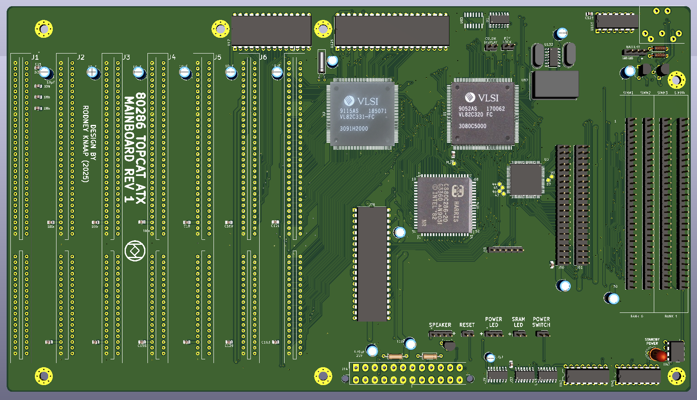
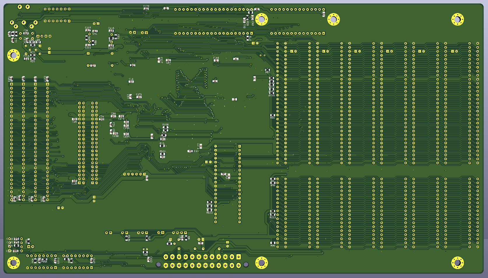
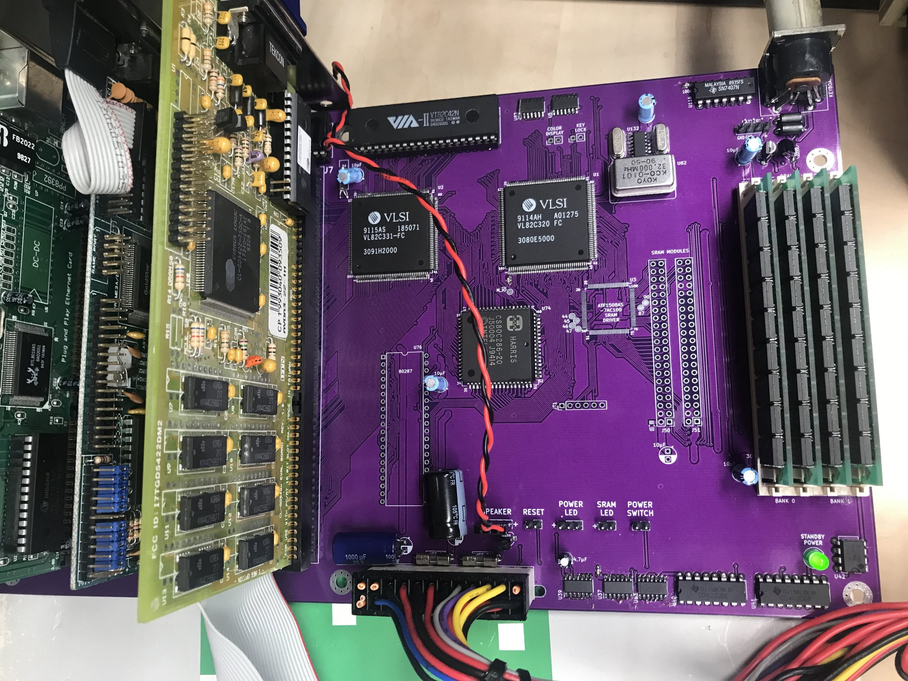
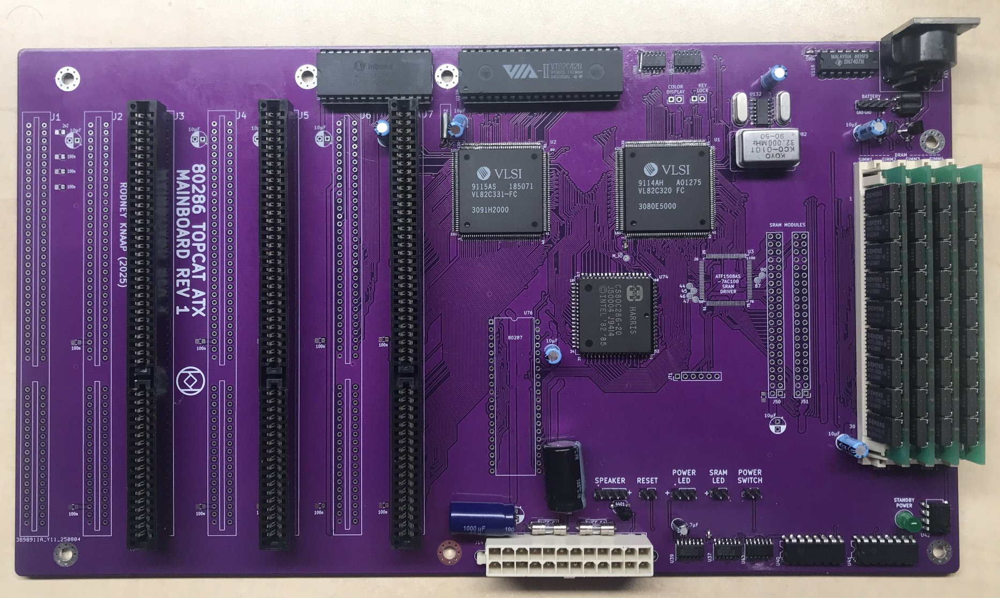

# ATX_TOPCAT_286_Mainboard
Design for a VLSI TOPCAT ATX 286 mainboard  

The project consists of a ATX mainboard and a SRAM module design, and is intended to at least initially operate with 30 pin standard DRAM SIMMs.  

  

  

## Purpose and permitted use, cautions for a potential builder of this design  

This project was created for historical purposes out of love for historical computing designs and for the purpose of enabling computing enthousiasts with a sufficient level of building and troubleshooting expertise to be able to experience the technology by building and troubleshooting the hardware described in this project. Due to the level of this project, it may be suitable as a project for students to get into. If there are any questions from teachers who like to teach about this technology I would be happy to answer them. It may be really interesting to analyse the elaborate and complex CPU timing and 8 bit to 16 bit data byte translation and DMA mechanisms in an educational setting.

Besides the GPL3 license there are a few warnings and usage restrictions applicable:
No guarantees of function or fitness for any particular or useful purpose is given, building and using this design is at the sole responsibility of the builder.

Do not attempt this project unless you have the necessary electronics assembly expertise and experience, and know how to observe all electronics safety guidelines which are applicable.

It is not permitted to use the computer built from this design without the assumption of the possibility of loss of data or malfunction of the connected device. To be used strictly for personal hobby and experimental purposes only. No applications are permitted where failure of the device could result in damage or injury of any kind.

If you plan to use this design or any part of it in new designs, the acknowledgement of the designer and the design sources and inspirations, historical and modern, of all subparts contained within this design should be included and respected in your publication, to accredit the hard work, time and effort dedicated by the people before you who contributed to make your project possible.

No guarantee for any proper operation or suitability for any possible use or purpose is given, using the resulting hardware from this design is purely educational and experimental and not intended for serious applications. Loss of data is likely and to be expected when connecting any storage device or storage media to the resulting system from this design, or when configuring or operating any storage device or media with the system of this design.

When connecting this system to a computer network which contains stored information on it, it is at the sole responsibility and risk of the person making the connection, no guarantee is given against data loss or data corruption, malfunctions or failure of the whole computer network and/or any information contained inside it on other devices and media which are connected to the same network.

When building this project, the builder assumes personal responsibility for troubleshooting it and using the necessary care and expertise to make it function properly as defined by the design. You can email me with questions, but I will reply only if I have time and if I find the question to be valid. Which will probably also lead to an update here. I want to primarily dedicate my time to new project development, I am not able to do any user support, so that's why I provide the elaborate info here which will be expanded if needed.

# About this project
This project is a design for a ATX 286 mainboard based on the VLSI VL82C320 / VL82C331 "TOPCAT" chipset.
This chipset supports both the 286 and the 386SX CPU.
The 286 was chosen instead of a 386SX because I find it more interesting to experiment with this CPU and I want to enhance the performance and operation by using overclocking.

After developing the CPLD based 286 ATX mainboard REV1, I got interested in the RealDOOM project developed by Patrick (sqpat).
Since his DOOM project is based on real mode operation of the 286, it makes use of EMS memory to increase the total capacity.
Also, EMS as a memory system is very suitable for swapping around pages of game data.
The EMS needs to support backfill which is able to replace the memory area between 256KB and 640KB of conventional memory.

I came across a suitable mainboard by MSI which is able to do this, however the mainboard was based on a 386SX, and not the 286 which I am more interested in.
So I decided to try to convert the VLSI TOPCAT chipset operation into 286 mode and interface this chipset to a 286.
Its an experiment and I want to do this relatively cheaply, so I decided to make a two layer PCB design for the mainboard, and I tried to reduce the PCB area in order to hopefully further reduce the total costs for manufacturing such a board.
This mainboard is a simple experiment, not a fully integrated mainboard such as my other projects. This was done intentionally because this project is meant as a test case to prove a concept of chipset operation. VLSI unfortunately didn't supply a lot of specific information for assembling a system, but rather kept the information down to the specific operation and configuration of the chipset.  So this design is a test concept to see if it will work the way it is designed.

If this mainboard is able to function, there is a secondary goal, which is to try to interface the DRAM operation of the VL82C320 to fast SRAM memory using a CPLD chip which translates the DRAM controls into SRAM signals. There are a few ways to try to go about this, and tests will indicate if any of these methods are able to be successful. Depending on the results, I may do similar work on other 286 chipsets.

Initially, the mainboard is designed to be able to run on 30 pin SIMMs. For example 1MB per SIMM capacity.
The mainboard can be operated without the CPLD and SRAM modules initially, though it is probably better to solder the CPLD and all the other SMD ICs to the board first to make sure these can be reached well for hand soldering, before adding the rest of the components which may make soldering the SMD parts more difficult.
On the bottom of the PCB are most of the passive components for this design. a PDF placement diagram is included.
On the memory module bottom side there are only 100nF bypass capacitors needed.

# Project status (updated 15-8-2025)  

  

  

  

  

I have debugged and tested the PCB, a few small issues are now fixed and I will update all the files including the gerbers to contain the updates shortly.
The board is currently under evaluation for further testing to achieve higher CPU clock frequencies with a Harris 20MHz rated 286 CPU.
Currently the board is verified up to 16MHz, and being investigated/tested for higher speeds.  

After concluding that work I will update the gerbers to reflect the system under testing.
However all modifications I am doing right now are easy to manually do as well with the current layout.
For example soldering some resistor networks on one of the ISA slot connectors, etc.  

In terms of what BIOS will work with this project:  
This page documents trigem VLSI board:  
https://theretroweb.com/motherboards/s/trigem-tg286e-plus#bios  
The AMI BIOS can be downloaded there.  
This BIOS is not ideal and the memory test needs to be skipped because parity cannot be disabled in this BIOS.  
Since I will be developing SRAM conversion in the future which is one of the design goals, I am not using any parity in the board design.  

I have confirmed full boot using XT-IDE in lite mode in order to support RealDOOM which is verified to fully work with this project board.  

The next development steps will be:  
- increasing the clock frequency
- adding SRAM conversion using the CPLD on the board
- eliminating DRAM completely

Currently the BIOS available for testing is extremely limited in terms of chipset control and user configurable options.  
Which affects the work I am able to do on the board.
Possibly in the future a better BIOS can be obtained to work with.
I am currently also seeking the AST BRAVO BIOS, if anyone has this board and able to do so, please upload this BIOS to The Retro Web and send me a message, thank you in advance!  
The BIOS I am looking for is the one which supports a 286 CPU module on this board:  
https://theretroweb.com/motherboards/s/ast-bravo-286-386sx-202382-001,-002,-005  

Kind regards,

Rodney
